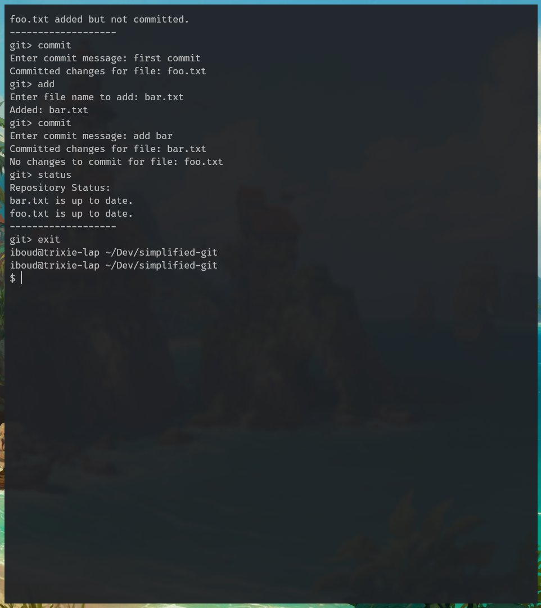
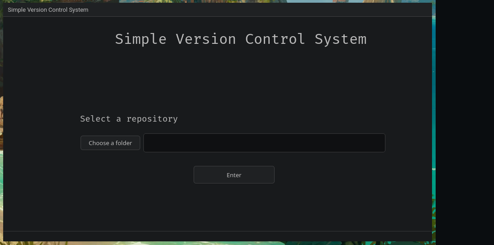

# simplified-git

## What this is

A learning project that reimplements a tiny slice of Git in C++. It's not a Git replacement and not meant to be - we are just reinventing the wheel to understand how a version-control tool tracks file changes under the hood.

The project is built around a small core (`File`, `Repository`, `Git`) and exposes that core through two front-ends: a command-line REPL and a Qt GUI.

## What it does

Four operations on a single directory: `init`, `add`, `commit`, `status`.

## Modes

**REPL (`sgit`)**: a `git>` prompt. Type `init`, `add`, `commit`, `status`, or `exit`. `add` and `commit` prompt separately for the filename and message.

**GUI (`sgit-gui`)**: a Qt window with two pages: pick a folder to init/open the repo, then pick files to add and commit through buttons.

Both front-ends use the same underlying core, so behavior is identical.

## Requirements

- C++17 compiler (GCC 9+ / Clang 10+ / MSVC 2019+)
- CMake 3.16 or newer
- Qt 6 (or Qt 5) - **only if you want the GUI**. The CLI builds with no Qt dependency.

Tested on Linux with GCC 14 and Qt 6. The CMake setup is portable; Windows and macOS should work but have not been verified.

## Build & run

```bash
cmake -B build
cmake --build build
```

This produces:
- `build/sgit`: the REPL
- `build/sgit-gui`: the Qt GUI (only if Qt was found at configure time)

If Qt isn't installed, the configure step prints `GUI: Qt not found, sgit-gui will be skipped` and the CLI still builds normally. Install Qt and reconfigure (`rm -rf build && cmake -B build`) to get the GUI.

### Running the REPL

```bash
./build/sgit /path/to/some/folder
```

The folder should be a throwaway directory (e.g. `/tmp/myrepo`), not your project root `status` lists every file in the directory and there's no ignore mechanism.

<p align="center">
  
</p>

### Running the GUI

```bash
./build/sgit-gui
```

Use the Browse buttons to select a folder, then files within it.

<p align="center">
  
</p>

## License

MIT. See [LICENSE](LICENSE).
